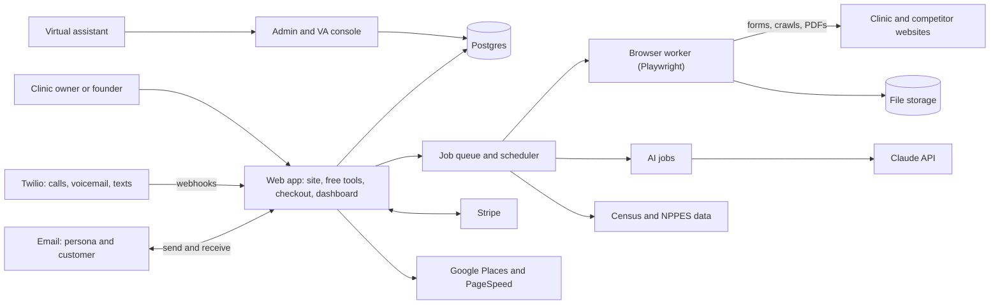

# Clinic Growth Suite — Product Spec (Draft v0.1)

> **Status:** brainstorm draft for review · **Date:** 2026-09-24 · **Working name:** TBD (codename "Cloud")
>
> **How to read this:** Sections 1–5 are the business view (about 10 minutes). Sections 6–12 are the build detail. Sections 13–17 cover go-to-market, money, the roadmap, and open questions. Every number here is a starting assumption to test, not a forecast.

## Contents

1. Summary
2. Decisions so far
3. Goals, non-goals, and ground rules
4. Who buys
5. Product lineup and funnel
6. Shared platform
7. Product specs
   - 7.1 Speed-to-Lead Secret Shopper (+ Monthly Retest)
   - 7.2 Visibility Score (+ Action Plan)
   - 7.3 HIPAA-Safe Review Reply Checker (+ Auto-Reply later)
   - 7.4 New-Clinic Location Report
   - 7.5 Treatment Landing-Page Kits (gated)
8. Clinic-type packs
9. Compliance and risk
10. Architecture and tech stack
11. AI design
12. Operations
13. Go-to-market
14. Costs and unit economics
15. Roadmap and go/no-go gates
16. Metrics
17. Open questions for you
- Appendix A: Secret Shopper scoring defaults
- Appendix B: Visibility Score defaults
- Appendix C: Glossary
- Appendix D: References

---

## 1. Summary

A small, cloud-hosted business that sells self-serve, mostly automated services to independent US clinics: med spas, hormone and weight-loss clinics, dental practices, and chiropractic / physical therapy / wellness clinics. It turns your patient-acquisition know-how into products that software delivers.

- **The core paid product** is the **Speed-to-Lead Secret Shopper.** Fictional new patients contact a clinic, the system records how the front desk follows up, and the owner gets a graded report with fixes. $199 per test, then $99/month for retests.
- **Two free tools bring owners in:** the **Visibility Score** (how the clinic compares online with nearby competitors) and the **HIPAA-Safe Review Reply Checker.**
- **A second product** serves people opening a clinic: the **New-Clinic Location Report** ($199–$499).
- **Treatment Landing-Page Kits** are specced here but only get built if customers ask for them.

Every product runs on public data or fictional patients. We never handle real patient data (PHI), which keeps HIPAA obligations, costs, and risk low.

## 2. Decisions so far

| Topic | Decision |
|---|---|
| Market | Independent US clinics (small businesses) |
| Clinic types in v1 | Med spa / aesthetics · Hormone & weight loss · Dental · Chiro / PT / wellness |
| Your edge | Know-how in winning patients; willing to spend money rather than time |
| Commitment | Side project: a few hours a week; launch budget around $500 |
| Business model | Productized services at fixed prices, delivered mostly by automation |
| Sales | Fully self-serve: website checkout, no sales calls |
| Secret Shopper channels (v1) | Inquiries go out by web form and email. Calls, voicemails, texts, and emails coming back are all captured. No outbound phone calls. |
| When automation gets stuck | A virtual assistant (VA) finishes the job from an admin to-do list |
| Where the spec lives | This file |

## 3. Goals, non-goals, and ground rules

**Goals**

- First paying customer within about 8 weeks of starting the build.
- About $5,000/month in revenue within 12–18 months (§14 shows what that takes).
- No more than ~4 hours a week of your time after launch; VA under 10 hours a week.
- Gross margin of 80% or more on every product.

**Non-goals for v1**

- Handling real patient data in any form.
- Phone calls or text messages *to* clinics.
- Booking real appointment slots (that would block real patients).
- Testing any clinic that hasn't bought and authorized the test.
- Custom, agency-style work. Markets outside the US.

**Ground rules (every product)**

1. **No real patient data.** Public business data or fictional personas only. If PHI shows up by accident, it's quarantined and deleted (§9.1).
2. **Only test what the buyer controls.** The Secret Shopper runs only on clinics the buyer has proven they own or manage.
3. **Self-serve by default.** Anything that needs a human goes to the VA queue, invisible to the customer.
4. **Evidence over opinion.** Every score links to what it's based on: screenshots, timestamps, quotes, recordings.
5. **Your playbook drives the scoring.** Targets, weights, and scripts live in a versioned playbook you can edit (§6.3), not in code.
6. **Honest numbers.** No invented statistics. Every estimate shows its assumptions.

## 4. Who buys

| Buyer | What they care about | What they buy |
|---|---|---|
| Clinic owner (1–5 locations, often also a provider) | Paying for marketing but unsure leads turn into patients; no time for sales calls; often buys on a phone at night | Free tools → Secret Shopper → Monthly Retest; Action Plan |
| Practice / office manager | Training the front desk; showing the owner it's improving | Reads the reports; often the day-to-day user |
| New-clinic founder (NP/PA, physician, dentist, chiropractor, entrepreneur) | Choosing a location and positioning before signing a lease | Location Report |
| Later: agencies and consultants that serve clinics | Tools to show their clients | Affiliate program first; white-label later (Phase 4) |

## 5. Product lineup and funnel

| Product | Price (starting point) | Role | Phase |
|---|---|---|---|
| HIPAA-Safe Review Reply Checker | Free (an email unlocks rewrites) | Brings owners in; builds the email list | 1 |
| Visibility Score | Free | Brings owners in; leads to paid products | 1 |
| Visibility Action Plan | $79 one-time (test $49–$99) | Low-cost first purchase | 3 |
| Speed-to-Lead Secret Shopper | $199 per test | Core product | 2 |
| Monthly Retest | $99/month | Recurring revenue | 2 |
| New-Clinic Location Report | $199 (one site) / $499 (compare three) | Second product, different buyer | 3 |
| Review Auto-Reply | ~$49/month per location | Recurring add-on | 4 (gated) |
| Treatment Landing-Page Kits | ~$149 per page + $29/month hosting | Add-on | 4 (gated) |

```
Free tools (Reply Checker, Visibility Score)
   └─► email capture + automated nurture emails
         └─► Secret Shopper test ($199)
               └─► Monthly Retest ($99/mo)   ◄── offered in every report
                     └─► add-ons: Action Plan, Auto-Reply, Landing Kits

New-clinic founders ─► Location Report ─► (once open) Secret Shopper
```

## 6. Shared platform

### 6.1 Accounts

- Passwordless sign-in by emailed link. No passwords to manage.
- An **organization** (the business) has one or more **locations.** Each location stores its Google place ID, website, phones, public email, hours, clinic type, and services.
- Roles: Owner and Manager (customer side); VA and Admin (our side).
- Free tools work without an account. Leaving an email creates a lightweight **lead**; an account is created at checkout.

### 6.2 Checkout and billing

- Stripe Checkout for one-time purchases and subscriptions. Stripe's customer portal handles card changes, invoices, and cancellation, so none of that needs a support request.
- Per-location pricing; coupons and referral credits.
- Refunds are issued from the admin console with your approval.
- Sales tax on digital services varies by state. Decide with an accountant (Stripe Tax is an option).

### 6.3 The playbook (your know-how, as data)

The playbook is the real product; the software just delivers it. There is one playbook per clinic type, versioned, containing:

- **Response standards:** speed targets (business hours and after hours), follow-up cadence, channels.
- **Grading rubric:** criteria, weights, and examples of good and bad replies.
- **Scripts:** phone opener, voicemail, email, and text templates, plus a 10-day follow-up sequence.
- **Persona banks:** services to ask about, realistic questions, objections.
- **Visibility Score weights and thresholds.**
- **Market notes** for the Location Report: target patients, saturation benchmarks, your insider rules of thumb.
- **Claims guardrails** for anything we write for clinics (used by the Landing Kits and templates).

It's stored as YAML/Markdown in this repo (`playbook/`) and previewable in the admin console. Every report records which playbook version graded it. In Phase 0, Claude drafts version 0 from common industry practice and you edit it (about 3–5 hours of your time).

### 6.4 Admin and VA console

- **To-do list** with task types: verify ownership, submit a form by hand, approve and send a persona reply, match an unrecognized call or message, QA a report, support request, refund. Each task has instructions, a deadline, and a "done" button that records minutes spent, for cost tracking.
- **Test timeline** showing every inquiry and every clinic touch, an evidence viewer, a report editor (edits are logged to improve prompts), customer lookup, and manual retry buttons.
- **Permissions:** VAs see only what their tasks need and never billing. Two-factor sign-in is required, and every action is logged.

### 6.5 Email and notifications

- **Transactional:** sign-in links, receipts, "your test is scheduled" (never with exact times), "your report is ready," monthly retest summaries, score-drop alerts.
- **Marketing:** automated nurture emails after someone uses a free tool, plus a monthly newsletter. Every email has one-click unsubscribe and a postal address (CAN-SPAM).
- **Daily ops digest** to you: tests running, overdue tasks, failures, spend vs. budget.

### 6.6 Website and analytics

- Pages: home, one page per product, pricing, a **sample report** (for a fictional clinic), FAQ, "How we protect privacy," legal pages, guides, and a library of safe review-reply examples.
- Privacy-friendly, first-party analytics for the funnel. **No session recording and no ad pixels on tool pages,** because people may paste sensitive text there.
- Accessible (WCAG 2.1 AA) and built for phones first, since owners often buy on their phones.

## 7. Product specs

### 7.1 Speed-to-Lead Secret Shopper (+ Monthly Retest)

**Promise:** "Find out what really happens when a new patient contacts your clinic, in two weeks, without a sales call."

**Packages**

- **Baseline Test — $199.** Three fictional new-patient inquiries sent over about four days. Each is tracked for 10 days, and the report arrives around day 15.
- **Monthly Retest — $99/month.** Two inquiries a month (rotating channels and services), trend charts and alerts, and a full three-persona test every quarter. It can be added after a Baseline Test with no minimum, or bought directly with a three-month minimum (the first cycle is then a full baseline).
- **Guarantee (proposed):** full refund if we can't deliver at least two inquiries. An optional stronger version: full refund within 30 days if the report doesn't surface at least one fix worth making.

**Customer flow**

1. "Start a test" → find the clinic by name (Google search box) → confirm details pre-filled from Google (website, phone, hours) → choose the clinic type and 1–3 services to ask about.
2. We auto-discover contact forms and the public email address. The owner confirms them and adds blackout dates (holidays, closures).
3. Optional question: "What is your front desk supposed to do with a new lead?" The report then compares reality with the owner's own standard.
4. Authorization checkboxes: I own or manage this clinic; I authorize fictional inquiries; I'll delete the test leads afterward. Then ownership verification (below).
5. Payment through Stripe Checkout.
6. The owner sees "Your test runs Oct 3–18." Exact times are never shown, so no one can tip off the front desk.
7. The report arrives by email with a secure link and a PDF.

**Ownership verification** stops a competitor from flooding a rival with fake leads.

- It passes automatically if the buyer's verified email is on the clinic website's domain.
- Otherwise a VA verifies in one of three ways: a code sent to the clinic's public email; a document check (a business license or similar that matches the buyer); or a call to the clinic's listed number asking for the owner or manager, without revealing any timing.
- Limits: one active test per location, and an alert when unrelated accounts try the same location. Buyer warranties and indemnity are in the terms.
- No test starts until verification passes. Failed verification means a full refund.

**Personas**

- Fictional, realistic people, varied by clinic type. They're generated from playbook templates plus AI and screened so they don't match real public figures.
- Each persona gets a unique email address and a unique local phone number (in the clinic's area code where possible). The addresses live on several personal-style "vanity" domains we own, never look-alikes of Gmail or other real providers.
- Default Baseline mix:

| Persona | Sent by | When | Behavior | What it measures |
|---|---|---|---|---|
| A — "Silent" | Web form | Weekday, business hours | Never replies | Speed, persistence, follow-up cadence, voicemail quality |
| B — "Engaged" | Email (or form) | After hours or weekend | Replies once with a question, then goes quiet | After-hours handling, answer quality, asking for the appointment |
| C — "Price check" | Web form (or email) | Weekday afternoon | Asks the price, then says "that's more than I expected" | Price transparency, objection handling, follow-up after a soft no |

- Personas never book or hold appointments, give payment details, share medical history ("I'd rather talk about that at the visit"), reply more than twice, or call the clinic.
- **In v1, AI drafts persona replies and a VA reviews and sends them.** Fully automatic replies come only after legal sign-off (§9.2).
- Persona replies go out by email only. If the clinic only calls or texts, the persona can email instead: "Sorry I missed your call. Could you email me the details?"

**Sending inquiries**

- **Web forms:** a headless browser opens the form, AI matches the fields to the persona, and the form is submitted with before/after screenshots and the confirmation message saved. CAPTCHAs, multi-step forms, or failures create a VA task due inside the scheduled window. We don't use CAPTCHA-solving services.
- **A broken form is a finding.** If the form genuinely fails (for example, on mobile), the VA confirms it, the persona switches to email, and the report leads with the problem.
- **Email:** plain, human-looking messages from the persona's mailbox to the clinic's public address, with no tracking pixels.
- **Online booking widgets are never used to book.**
- **Timing rules:** random times inside set windows; at least 24 hours between personas; each persona asks about a different service; holidays and blackout dates are skipped. The clock starts at the actual send time.

**Capturing the clinic's follow-up**

- **Email replies** → inbound webhook → matched by persona address → stored with timestamps (quoted history stripped).
- **Calls** are never answered live. A short voicemail greeting in the persona's name plays, and voicemails are recorded and transcribed. Missed calls without a voicemail are still logged (time, caller ID, call length).
- **Texts** are stored (receive-only in v1).
- AI labels each touch: personal reply, auto-reply, marketing blast, reminder, and so on. Automated messages count, but separately from human ones.
- **Matching:** each number and address belongs to one active persona at a time, so anything arriving on it belongs to that test. Unrecognized callers go to a VA.
- **Window:** 10 days per persona. Touches on days 11–14 are logged as "late" and not scored. Numbers then sit in a 30-day quarantine before reuse.
- If the clinic asks for intake forms, insurance details, or a date of birth, the persona politely doesn't provide them. That step is noted as part of the clinic's process.

**Scoring** (defaults in Appendix A; your playbook sets the real numbers)

- Four parts: **Speed 35 · Persistence 25 · Conversation quality 30 · Reachability 10**, for a 0–100 score and a letter grade.
- Clocks follow the clinic's time zone and hours. An after-hours inquiry is timed from opening, with credit for an instant auto-reply that includes a booking link.
- Every AI judgment must quote its evidence, and outputs are validated JSON. Low-confidence grades go to review.
- **Worth-a-look notes (not scored):** unsupported claims ("guaranteed results"), requests for medical details by plain email or text, pressure tactics. These are framed as observations, not legal conclusions.
- **Benchmarks:** against playbook targets at launch, and against anonymized averages for the same clinic type once there are 20+ tests.

**The report** (a web page and a PDF, readable on a phone)

1. Headline and grade, e.g., "2 of 3 new-patient inquiries never got a call back."
2. A timeline per persona: the inquiry, then every touch with its channel and time.
3. Scorecard with evidence: screenshots, quotes, voicemail audio and transcripts.
4. The top three fixes, ranked by impact.
5. **Fix-it kit:** scripts personalized to the clinic and its services (phone opener, voicemail, email, text) and a 10-day follow-up cadence.
6. **Missed-revenue calculator:** the owner enters monthly inquiries and new-patient value, and every assumption is visible.
7. **Cleanup list:** persona names, emails, and numbers to delete from the clinic's lead tracker or patient system.
8. Coaching note: results are grouped by channel and time, not by staff member. Use them to train, not punish.
9. Next steps: the Monthly Retest offer.

**Monthly Retest**

- Two inquiries a month (one form, one email; rotating services and personas), plus a full three-persona test each quarter.
- A dashboard with speed, persistence, and quality trends.
- Alerts when the score drops 15+ points or an inquiry gets no response within 48 hours.
- A short monthly report and a full report each quarter.

**Edge cases**

| Situation | What happens |
|---|---|
| No web form | All personas use email |
| No form and no public email | Can't test in v1 → refund before the start |
| CAPTCHA or multi-step form | VA submits inside the scheduled window |
| Form fails to submit | VA confirms; persona switches to email; the failure becomes a top finding |
| Clinic's email bounces | Top finding; personas use the form |
| Clinic seems to spot a test | Noted in the report; free re-run with new personas |
| Unexpected closure | Pause and reschedule |
| Follow-ups after the window | Logged as late; not scored |
| Clinic sends another patient's information by mistake | PHI tripwire (§9.1) |
| Owner cancels mid-test | Stop new inquiries; send a partial report; prorated refund |

**Unit cost (estimate):** phone numbers and usage $2–5 · AI $1–3 · VA time 10–20 minutes ($3–6) · Stripe ~$6. That's **about $12–20 per $199 test (~90% margin).** A retest costs about $6–12 per $99.

**Targets:** 95%+ of tests complete with the report on time · VA time under 15 minutes per test by month 3 · refunds under 5% · 30%+ of Baseline buyers start a Retest · Retest churn under 5% a month.

### 7.2 Visibility Score (+ Action Plan)

**Promise:** "See how your clinic stacks up against nearby competitors in 60 seconds. Free."

**Free flow**

1. Find the clinic (Google search box) → pick the clinic type and main service → optional email.
2. Live checks with a progress screen (~30–60 seconds): Google profile signals, the competitor set, website speed, and a booking-ease crawl.
3. Results: an overall score (0–100), four pillar scores, a competitor table (rating, review count) credited to Google, and three quick wins.
4. Calls to action: "Email me my results" (captures the email), "Get the full Action Plan," and "Do these leads turn into patients? Test your front desk."

**Pillars** (defaults in Appendix B)

- **Reputation (40):** rating vs. the local median, review count vs. competitors, how recent the newest review is.
- **Booking ease (30):** online booking, tap-to-call on mobile, a short contact form, a text or chat option, and a new-patient button visible on a phone without scrolling.
- **Website speed (20):** Google PageSpeed mobile score, Core Web Vitals (where available), HTTPS and mobile layout.
- **Profile completeness (10):** hours, website, phone, photos.

**How it works**

- **Competitors:** a Google Places text search for the clinic type's keywords around the clinic, excluding the clinic itself. The radius widens until there are at least 5 results (up to ~25 miles), and the top 10 are kept.
- **Booking-ease crawl:** a headless browser loads the homepage and up to 5 key pages (contact, booking, services). It detects known booking tools (e.g., Vagaro, Mindbody, Boulevard, Jane, Zocdoc, NexHealth, Calendly, Acuity; the list lives in config), tap-to-call links, form fields, and chat or text widgets, and takes a phone-sized screenshot. It follows robots.txt and crawls politely.
- **Cost control:** the free result uses rules and pre-written quick wins with no AI, so it costs about $0.03–0.10 per score (mostly Google API fees). Protections: a bot check (Cloudflare Turnstile), daily limits per IP address and email, Google Cloud budget alerts, and hard API quotas.

**Paid Action Plan — $79** (test $49 vs. $99)

- Everything in the free score, plus:
  - website speed and booking features compared with the top 5 competitors;
  - AI review of the clinic's mobile homepage screenshot next to the best competitor's;
  - a 30/60/90-day plan written from your playbook;
  - templates: a Google Business Profile description, a review-request script for staff, and a fix list for their web person;
  - a free re-check after 30 days.

**Google terms (important).** Google Maps Platform rules generally don't allow storing Places content such as ratings, review counts, and reviews, though place IDs may be stored. They also require attribution, and Places data shown on a map must use a Google map. The design therefore stores place IDs, owner-entered data, and our own analysis, and re-fetches Google fields whenever a report is shown. Counsel should confirm whether stored scores and PDF snapshots are allowed. These rules are also why we can't publish "scores for every clinic in town" as search-traffic pages.

**Targets:** 30%+ of people who run a score leave an email · 2–3% buy the Action Plan · track how many go on to buy the Secret Shopper.

### 7.3 HIPAA-Safe Review Reply Checker (+ Auto-Reply later)

**Promise:** "Paste your reply before you post it. We'll catch anything that could expose patient privacy, and rewrite it."

**Why now:** HHS has fined practices $23,000–$50,000 over review replies that revealed patient information. Meanwhile, Google has been testing a built-in "Reply to reviews with AI" button (first spotted in March 2026) that knows nothing about HIPAA.

**Flow**

1. Paste the draft reply (required) and the review (optional), pick the clinic type (optional), and pass a bot check.
2. Instant verdict: **Safe / Needs changes / Unsafe,** with the risky phrases highlighted and explained.
3. Rewrites unlock with an email address; they're shown right away and also emailed. There are three: short and warm; service recovery with an offline contact; and, for positive reviews, grateful without confirming the person is a patient. Marketing consent is a separate checkbox.

**What it flags**

| Category | Examples | Severity |
|---|---|---|
| Confirms they're a patient | "when you came in," "your appointment," "our records show," "as your provider" | Unsafe |
| Treatment or condition details | Procedure or drug names tied to the reviewer; results; side effects; diagnoses | Unsafe |
| Identifiers | Names, dates, times, which staff member saw them | Unsafe / caution |
| Billing or insurance | Balances, claims, coverage | Unsafe |
| Arguing about their care | "You were told about the risks…" | Unsafe |
| Tone | Defensive, sarcastic, blaming | Caution |
| No private path | No invitation to contact the office directly | Caution |

**Detection uses two layers:**

1. **Rules first:** phrase lists per clinic type (procedures, drugs, appointment words) plus name and date patterns.
2. **AI review** against a strict rubric, returning JSON with the flagged text, category, and reason.
3. **Rewrites are re-checked by both layers.** If a rewrite still trips a rule, the tool falls back to a vetted safe template.
4. Positive reviews are checked too: "Glad your filler looks great, Jane!" is unsafe.

**Privacy design** (owners may paste patient details by accident)

- Text is processed in memory and never stored. Request bodies are never logged, error reports are scrubbed, and the page has no analytics or session recording.
- We store only the timestamp, verdict, categories, clinic type, and email if given.
- On-page notice: "Don't paste patient names or anything you wouldn't post publicly."
- Confirm the AI provider's data-retention settings. Ask Anthropic about zero data retention, and whether a BAA is available in case counsel says one is needed.
- Question for counsel: does accidentally receiving PHI here make us a business associate? (§9.8)

**Extras**

- **Safe-reply library:** static example pages by clinic type and scenario (long wait, price complaint, bad outcome, rude staff, glowing review). They're written from scratch, not copied from real reviews, and they're good for search traffic.
- **Limits:** 5 checks a day without an email; 30 a day with one.
- **Cost:** about $0.02–0.06 per check on a top-tier Claude model. Option (your call): a smaller, cheaper model for this free tool if it scores the same on our test set (§11).

**Later: Auto-Reply (~$49/month per location)**

- The owner connects their Google Business Profile. We watch for new reviews and draft safe replies, which the owner approves by email with one tap. Auto-posting is optional for 4–5 star reviews; negative reviews always need approval. A weekly digest summarizes activity.
- This needs Google's approval for Business Profile API access, a manual review that can take weeks, so **apply in Phase 0.**
- Build it only if the checker gets 100+ users a month and 10+ owners join the waitlist.

### 7.4 New-Clinic Location Report

**Promise:** "Before you sign a lease: see the demand, the competition, and the gaps, in one report."

**Packages:** **Standard $199** (one site) · **Pro $499** (compare up to three sites, plus a competitor price scan and a 90-day launch plan).

**Inputs:** the clinic type and services; candidate address(es); the trade area (radius suggested by density — about 3 miles urban, 7 suburban, 15 rural — and adjustable); target patients (playbook defaults per clinic type, editable); and, optionally, positioning (premium, value, or membership).

**Data**

| Need | Source | Can we store it? |
|---|---|---|
| Population, age, sex, income, growth | Census American Community Survey (5-year) via the Census API | Yes (public) |
| Business counts by industry | Census Business Patterns (e.g., NAICS 621210 dentists, 621310 chiropractors, 621340 physical therapists) | Yes |
| Licensed providers by specialty | CMS NPPES provider registry (monthly file) | Yes |
| Named competitors, ratings, reviews, websites | Google Places (live) | No — fetch when shown, credit Google |
| Competitor websites: booking tools, speed, posted prices | Our crawler + PageSpeed + AI extraction | Yes (our own analysis) |
| Search demand (Pro, optional) | A paid keyword-volume API | Per vendor terms |

**Analysis**

- **Demand:** target patients in the trade area, income, growth.
- **Supply:** named competitors plus counts, and providers per 10,000 residents compared with state and national levels.
- **Quality gap:** the share of competitors under 4.3 stars or 50 reviews, without online booking, or with slow sites. These are the "beatable" competitors.
- **Prices (Pro):** posted prices from competitor sites (e.g., neurotoxin per unit, TRT monthly program, weight-loss program, new-patient dental special, IV drip), marked "found on X of Y sites" with links.
- **Market Opportunity Score (0–100):** demand 35 · competition gap 30 · affluence 20 · growth 15, with defaults per clinic type in the playbook.
- **Narrative:** AI writes it from the data and your market notes: who to target, positioning, pricing stance, a patient-acquisition plan for the first 90 days, and risks.
- **"Questions for your attorney and accountant":** a checklist covering state rules on med spa ownership and supervision, prescribing rules for controlled substances such as testosterone, compounded-drug marketing, and dental advertising rules. It's a checklist, not legal advice.
- **Pro:** a side-by-side comparison of the sites with a recommendation.

**Delivery:** built in the background (10–20 minutes) and delivered by email, web page, and PDF (subject to the Google terms note in §7.2). Maps that show Google data use Google Maps.

**Disclaimers:** estimates are built from public data. The report isn't financial or legal advice; verify locally.

**Cost:** about $1–3 of AI plus $0.50–2 of Google fees per report (~95% margin).

### 7.5 Treatment Landing-Page Kits (gated)

**Build only if** there are 50+ paying Secret Shopper/Retest customers **and** 10+ customers click "I want this" in the dashboard. Until then, just collect interest.

**Promise:** "A patient-ready page for one treatment, plus matching ad copy, live in 15 minutes."

**Packages:** ~$149 setup per page + $29/month hosting (or $79/month for up to five pages).

**Flow:** pick a treatment template → enter clinic details, prices or offers, the booking link, phone, provider credentials, and the clinic's own photos → AI writes the copy within guardrails → preview → attestations (a licensed provider reviewed the claims; consent exists for any photos or testimonials) → publish on our domain or the clinic's subdomain, with HTTPS set up automatically.

**Templates (v1)**

- **Med spa:** neurotoxin, filler, laser hair removal.
- **Hormone & weight loss:** TRT consult, menopause hormone therapy consult, medical weight-loss program.
- **Dental:** new-patient special, implant consult, clear aligners.
- **Chiro / PT / wellness:** new-patient special, PT evaluation, IV hydration.

**Ad copy pack:** Google Search responsive ads (headlines ≤30 characters, descriptions ≤90); Meta ad text that doesn't imply the reader has a health condition (not "Struggling with low T?"); email and text promos for the clinic's own patient list.

**Guardrails**

- A per-type claims library of approved phrasing.
- Blocked terms: "guaranteed," "cure," "permanent," "FDA-approved" for compounded drugs, unsupported superlatives, and "specialist" where it isn't earned.
- Required disclaimers (results vary; prescriptions require a medical evaluation).
- Consent attestations for testimonials and before/after photos (FTC endorsement rules).
- Extra review for weight-loss and compounded-drug copy.

**Privacy:** our pages have no forms. Buttons go to the clinic's own booking page or phone, so we never receive patient data. There are no third-party ad pixels (because of HHS tracking guidance and state health-data laws such as Washington's My Health My Data Act), only first-party page views and button clicks.

**Upkeep:** ad-platform and regulatory rules keep changing, so schedule a quarterly review (2–4 hours). This ongoing upkeep is why this product comes last.

## 8. Clinic-type packs

Each clinic type gets its own pack in the playbook. Starting defaults:

| | Med spa / aesthetics | Hormone & weight loss | Dental | Chiro / PT / wellness |
|---|---|---|---|---|
| **Services personas ask about** | Neurotoxin, fillers, laser hair removal, skin treatments | TRT consult, menopause hormone therapy, medical weight-loss program | New-patient exam, emergency visit, clear aligners, implants, whitening | New-patient visit, PT evaluation (back or knee), IV hydration |
| **Typical persona questions** | Price per unit or syringe; is the consult free; downtime; openings this week | Monthly cost; are labs included; insurance; telehealth option; how soon to start | Which insurance; new-patient special; how soon; payment plans | Insurance or cash price; referral needed (PT); how soon; what's in the drip |
| **Competitor search terms** | med spa, medical spa, botox, laser hair removal | testosterone clinic, hormone replacement therapy, medical weight loss | dentist, cosmetic dentist, dental implants, emergency dentist | chiropractor, physical therapy, IV therapy |
| **Default target patients (Location Report)** | Women 25–64, higher household income | Men 35–64 (TRT); women 40–60 (menopause); adults 30–64 (weight loss) | All ages; implants and cosmetic skew 45+ and higher income | Adults 25–64; active, working population |
| **Extra supply data** | Industry counts are unreliable for med spas — rely on Google | Unreliable — rely on Google | NAICS 621210; NPPES dentists | NAICS 621310 (chiro), 621340 (PT); NPPES |
| **Copy watch-outs** | "Permanent" or "no downtime" promises; before/after consent; calling any neurotoxin "Botox" | Compounded GLP-1 claims ("FDA-approved," "same as" a brand); promised weight loss; testosterone benefit claims; controlled-substance prescribing rules | "Painless" promises; "specialist" claims, which many state boards restrict | IV claims about immunity or cures (the FTC has acted on these); chiropractic claims beyond musculoskeletal care |

Your insider notes replace these defaults.

## 9. Compliance and risk

### 9.1 HIPAA posture by product

| Product | Patient data? | Notes |
|---|---|---|
| Secret Shopper | None expected (personas are fictional) | PHI tripwire below |
| Visibility Score | None (public business data) | — |
| Reply Checker | Possible, by accident | Never stored; ask counsel (§9.8) |
| Location Report | None (public data) | — |
| Landing Kits | None (no forms, no pixels) | — |
| Auto-Reply (later) | Public reviews only | Ask counsel before building |

**PHI tripwire:** anything we receive that appears to contain a real patient's information (e.g., a clinic emails a persona someone else's records) is flagged by the system or a VA. Access is then limited to admins, the customer is told, the material is deleted within 7 days, and the event is logged.

### 9.2 Secret Shopper honesty and consent

- Buyer authorization plus ownership verification come before any test.
- We never test clinics that didn't buy, and we never use test results as cold outreach.
- Personas never book, pay, or share health details.
- In v1, a VA sends the AI-drafted persona replies.
- **For counsel:** state bot-disclosure laws (e.g., California's) for any AI-sent messages; fictional identities in authorized mystery shopping; recording and transcribing voicemails.

### 9.3 Calls and texts

- No outbound calls or texts in v1.
- Voicemails left for personas are ordinary voicemail recordings.
- Live-call tests (Phase 4) must handle states that require every party's consent to record.
- Any outbound texting needs US carrier registration (A2P 10DLC) and a check that carriers allow this use case.

### 9.4 Google

- Places data: storage limits, attribution, and the Google-map requirement (§7.2).
- The Business Profile API (for Auto-Reply) requires Google's approval.

### 9.5 Marketing email

- CAN-SPAM: honest headers and subject lines, one-click unsubscribe honored promptly, and a postal address.
- Cold outreach runs on separate sending domains, managed by a contractor.
- We never buy or use patient lists.

### 9.6 Health claims and advertising

These apply to the Landing Kits and to any template we write:

- FTC rules on substantiation and endorsements.
- FDA and compounding issues for weight-loss drugs.
- State dental-board advertising rules.
- Google and Meta ad policies.

### 9.7 AI outputs

- Scores are estimates, and we say so.
- Nothing we produce is legal or medical advice.
- A human reviews early reports and anything the AI is unsure about.

### 9.8 Legal review checklist

Book one to two hours with a healthcare attorney in Phase 0 to cover:

1. Are we a HIPAA business associate for any product, especially the Reply Checker and Auto-Reply? If so, what's required?
2. Secret Shopper: the authorization flow, buyer warranties, fictional personas, AI-drafted replies, recording and transcribing voicemails, and any state-specific issues.
3. Google Maps Platform terms for scores, stored results, PDFs, and competitor tables.
4. CAN-SPAM for nurture and cold email; use of testimonials.
5. Landing Kits: the claims-review process and who carries the liability.
6. Terms of Service, Privacy Policy, refund policy, and limits of liability.
7. Entity type and insurance (general liability, errors & omissions, cyber).

### 9.9 Top risks

| Risk | Mitigation |
|---|---|
| Clinic owners never find us (distribution) | Free tools, search content, contractor-run cold email, affiliates. The Phase 1 gate measures this early. |
| A competitor abuses the Secret Shopper | Ownership verification, one active test per location, terms of service |
| A legal surprise | Attorney review in Phase 0; the no-PHI design; humans send persona replies in v1 |
| Google terms or API approval | Live fetch, store place IDs only, credit Google; Auto-Reply is gated |
| AI grading mistakes | Evidence quotes, test sets, QA on early reports, human review when confidence is low |
| Brittle form automation | VA fallback, a list of known form types, monitoring |
| Free platform features catch up (e.g., Google's AI replies) | The paid Secret Shopper is hard to copy; healthcare-specific guardrails |
| VA unreliable or unavailable | Written procedures, deadlines, a backup VA |
| Clinics spot the personas | Varied personas and domains, limited reuse, local phone numbers |

## 10. Architecture and tech stack

### 10.1 Principles

- **Managed services that scale to zero,** so a quiet month costs almost nothing.
- **One language (TypeScript)** for the app and the workers, since it has the largest pool of contractors.
- **Everything lives in this repo:** code, playbook, prompts, test sets.
- Boring, well-documented tools over clever ones.

### 10.2 Default stack

| Layer | Default | Why | Alternative |
|---|---|---|---|
| Web app and API | Next.js on Google Cloud Run | Scales to zero; one Google bill alongside the Maps APIs | Vercel |
| Timed and recurring jobs | Google Cloud Tasks + Cloud Scheduler | Inquiries fire at exact future times | Inngest or Trigger.dev |
| Browser automation | Playwright in a Cloud Run job | Forms, crawls, screenshots, PDFs | A hosted browser service |
| Database | Postgres (Neon or Cloud SQL) | Cheap to start; relational data | Supabase |
| Files | Google Cloud Storage (private, expiring links) | Screenshots, voicemails, PDFs | S3 or R2 |
| Sign-in | Email links (e.g., Firebase Authentication) | Passwordless; free tier | Auth.js, Clerk |
| Payments | Stripe Checkout, Billing, customer portal | Self-serve billing | — |
| Phone | Twilio: numbers, voicemail recording, inbound texts | Pay per use | Telnyx |
| Speech-to-text | Twilio transcription or a dedicated speech-to-text API | Voicemail transcripts | — |
| Persona email | Vanity domains; a transactional email API for sending; an email-routing webhook for receiving | Unique addresses at low cost | A mailbox provider + IMAP |
| Customer email | A transactional provider + an email-marketing tool | Receipts; nurture sequences | — |
| AI | Claude API with structured (JSON) outputs | Grading, classification, writing | — |
| Public data | Google Places API (New), PageSpeed Insights API, Census API, NPPES files | Scores and reports | — |
| Bot protection | Cloudflare Turnstile | Protects the free tools | reCAPTCHA |
| Monitoring | Error tracking with data scrubbing; uptime checks; budget alerts | Low-maintenance ops | — |

### 10.3 System diagram



### 10.4 Repository layout (proposed)

```
SPEC.md
playbook/        your know-how: shared rules + one file per clinic type (YAML, versioned)
prompts/         versioned AI prompts
evals/           test sets for grading, reply checking, and form filling
apps/web/        Next.js: site, free tools, checkout, dashboard, admin/VA console
apps/worker/     jobs: scheduling, browser automation, AI grading, PDFs
packages/core/   scoring engine, rubric logic, shared types
infra/           deployment and setup scripts
```

### 10.5 Data model (main tables)

| Table | Holds |
|---|---|
| organizations, users, memberships | Customers, people, roles |
| locations | Clinic locations: Google place ID, website, phones, emails, clinic type, services, time zone, owner-confirmed hours, verification status |
| verifications | Ownership checks: method, result, reviewer, evidence |
| orders, subscriptions | Stripe-linked purchases and plans |
| playbook_versions | Which playbook version graded what |
| shopper_tests | Baseline or retest, status, window, score, grade, playbook version |
| persona_assignments | Persona profile, script (silent / engaged / price check), channel, email address, phone number, scheduled and sent times |
| outbound_messages | What each persona sent and when, evidence, and whether a bot or a VA sent it |
| inbound_events | Every email, text, call, and voicemail back: time, sender, content or transcript, recording, label, late flag |
| grades | Category scores, evidence references, confidence, AI run |
| reports | Kind, status, web link, PDF, who QA'd it, when it was sent |
| phone_numbers | Number pool: available / assigned / quarantined, with dates |
| ops_tasks | VA to-dos: type, status, assignee, deadline, minutes spent |
| visibility_scans | Inputs and our computed results (no stored Google fields) |
| reply_checks | Timestamp, verdict, categories, clinic type (never the text) |
| leads | Email, source, consent, unsubscribe date |
| location_reports | Inputs, tier, status, outputs |
| ai_runs | Purpose, prompt version, tokens, cost, latency, outcome |
| audit_log | Who did what, and when |

### 10.6 Secret Shopper under the hood

1. Checkout succeeds → the test is created → the verification task runs.
2. Once verified, personas are generated, numbers and addresses assigned, and three inquiries scheduled as timed tasks.
3. At send time, the browser worker submits the form or the email goes out. Failures become VA tasks with deadlines.
4. Webhooks record every inbound email, call, voicemail, and text against its assignment. Voicemails are transcribed.
5. For the Engaged and Price-check personas, AI drafts replies and a VA approves and sends them.
6. When all windows close, AI labels and grades the touches with evidence, the scoring engine applies the playbook weights, and the report is written and rendered to web and PDF.
7. QA gate (every report at first; later a 10% sample plus any low-confidence ones) → the report is sent → retest offer.
8. Numbers go into quarantine. The cleanup list is attached to the report.

### 10.7 Security and data retention

- HTTPS everywhere; encryption at rest (managed defaults); two-factor sign-in for admins and VAs; least-privilege access; secrets kept in a secret manager.
- Webhook signatures are verified (Stripe, Twilio, inbound email), and evidence links expire.
- Daily backups kept for 30 days, and automated pull requests for dependency updates.
- **Retention:**
  - Secret Shopper evidence: 24 months, or 30 days after account deletion.
  - Voicemail audio: 12 months.
  - Reply Checker text: never stored.
  - Scan results: 12 months.
  - Leads: until they unsubscribe; after that, only a suppression-list entry.
  - Deletion on request within 30 days.

### 10.8 Environments and the test clinic

- Development, staging, and production.
- A **fake "test clinic"** that we control: a website with a contact form, an inbox, and a phone number. Full Secret Shopper runs can be tested end to end against it without bothering real clinics, and it doubles as the source of the sample report.

## 11. AI design

**Where AI is used:** mapping form fields; drafting persona replies; labeling inbound messages (personal vs. automated vs. marketing); grading with evidence; writing reports and fix-it kits; Reply Checker flags and rewrites; Action Plans; Location Report narratives and price extraction; landing-page and ad copy.

**Rules**

- Structured JSON outputs, validated against schemas.
- Every judgment quotes its evidence. No quote, no score.
- Fixed rules run before AI on safety checks. The AI catches more, and the rules guarantee the basics.
- Prompts live in `prompts/` and are versioned. Each AI call is logged in `ai_runs` with its prompt version, tokens, and cost.
- Low confidence → human review. No medical or legal advice.
- Prompt openings stay stable so they can be cached. Batch processing (half price) handles anything that isn't urgent, such as quarterly re-scores.

**Model choice:** a top-tier Claude model by default for grading and writing. A smaller, cheaper Claude model is an option for simple, high-volume work (the free Reply Checker, labeling auto-replies), but only if it matches quality on the test sets. That cost-vs.-quality call is yours.

**Test sets (evals)** run on every prompt or model change, and a drop in quality blocks the release:

- ~50 fictional clinic responses with expected grades.
- ~200 review replies labeled safe or unsafe by category, including tricky positive ones.
- Saved copies of common real-world form types, for form-filling tests.

**AI cost estimates** (at current top-tier prices of about $5 per million input tokens and $25 per million output tokens, Sept 2026):

| Job | Estimated AI cost |
|---|---|
| Secret Shopper Baseline Test | $1–3 |
| Monthly Retest | $0.50–1.50 |
| Reply Checker (per check) | $0.02–0.06 |
| Visibility Action Plan | $0.30–1 |
| Location Report | $1–3 |
| Landing page + ad pack | $0.25–1 |

## 12. Operations

- **Your time after launch:** ~2–4 hours a week reviewing flagged reports, answering escalations, updating the playbook, and approving marketing content.
- **VA:** 5–10 hours a week to start, overlapping US business hours for scheduled form submissions. Written procedures cover every task type. The VA is paid hourly, with minutes tracked per task for cost reporting.
- **Deadlines:** form-submission tasks inside the scheduled window (≤2 hours); persona replies within 1–4 hours (which looks natural); report QA within 1 business day; support within 1 business day.
- **Support:** a help center plus email with saved replies. Refunds need your approval.
- **Monitoring:** the daily ops digest (§6.5), plus alerts on failures and spend.
- **Maintenance:** monthly dependency updates, updates to the booking-tool detection list, and a quarterly policy review.
- **The VA must never** call a clinic as a persona, book an appointment, give payment details, share a real identity, or contact a clinic outside a paid test.

## 13. Go-to-market

- **Positioning:** "Built by clinic operators. No sales calls. Privacy-safe by design."
- **Channels:**
  - **Search:** the free tools, the safe-reply library, and speed-to-lead guides for each clinic type.
  - **Communities:** owner groups and forums for each clinic type. Share the free tools; no spam.
  - **Cold email** (run by a contractor, CAN-SPAM compliant): personalized with public signals and linking to a free score that runs live when clicked.
  - **Affiliates:** consultants and agencies that serve clinics (e.g., 20% recurring commission).
  - **Paid search:** only after conversion rates are known.
- **Nurture emails after a free tool:**
  - Day 0: results.
  - Day 2: "How fast does your front desk respond?"
  - Day 5: a walkthrough of the sample report.
  - Day 9: the Secret Shopper offer with the guarantee.
  - Then monthly tips.
- **Beta (optional):** 5–10 friendly clinics at a discount, for QA and (with permission) testimonials.
- **Pricing experiments:** Action Plan at $49 vs. $99; Secret Shopper at $149 vs. $199 vs. $249.

## 14. Costs and unit economics

**Launch budget (one-time)**

| Item | Estimate |
|---|---|
| Product domain + 3 persona domains | ~$50/year |
| Twilio starting balance + first numbers | $20–40 |
| Google Cloud and APIs | ~$0 (free tiers at launch) |
| Healthcare attorney, 1–2 hours | $300–800 |
| LLC filing (if you don't already have one) | $50–500, depending on the state |

Without the attorney, launch costs are well under $200. With the attorney, plan on $500–1,000. **The legal review is the one cost not to skip,** because of the Secret Shopper.

**Monthly running cost at launch** (~20 tests, 10 retests, ~1,000 free checks a month)

| Item | Estimate/month |
|---|---|
| Hosting, jobs, storage | $0–25 |
| Database | $0–20 |
| Phone number pool (10–20 numbers) + usage | $15–40 |
| AI | $20–60 |
| Google Maps Platform beyond the free tier | $0–30 |
| Email (transactional + marketing) | $0–30 |
| **Subtotal before VA** | **~$35–200; expect ~$50–100 at launch volume** |
| VA (8–10 hours at $10–15/hour) | $80–150 |

**Unit economics**

| Product | Price | Direct cost | Gross margin |
|---|---|---|---|
| Secret Shopper | $199 | $12–20 | ~90% |
| Monthly Retest | $99/month | $6–12 | ~90% |
| Action Plan | $79 | ~$3–5 | ~95% |
| Location Report | $199 / $499 | $8–20 | ~90–95% |

**What $5,000/month takes (illustrative)**

- Sell ~11 Baseline Tests a month (~130 in the first year).
- If 30% become Retest subscribers and 5% of subscribers cancel each month, that's ~30 subscribers by month 12.
- Month-12 revenue: ~30 × $99 + ~11 × $199 ≈ **$5,200/month**, before add-ons.
- If 1–2% of free-tool users buy a test, 11 tests a month needs ~550–1,100 free-tool users a month. Cold email and affiliates may convert better. **Getting found is the bottleneck, not the software,** which is why the Phase 1 gate measures it.

## 15. Roadmap and go/no-go gates

Build times assume Claude writes most of the code and you review it. They're rough.

**Phase 0 — Foundations** (1–2 weeks; ~6–8 hours of your time)

- Choose a name; buy domains; set up an LLC (if needed), a business bank account, Stripe, Google Cloud with budget alerts, Twilio, and email accounts.
- Legal review (§9.8) and first drafts of the Terms of Service and Privacy Policy.
- Playbook v0: Claude drafts it, you edit it.
- Apply for Google Business Profile API access now (long lead time; only Auto-Reply needs it).
- Build the test clinic (§10.8).
- **Exit when:** playbook v0 is approved, the accounts are live, and the attorney is OK with the no-PHI design and the Secret Shopper consent flow.

**Phase 1 — Free tools and website** (~2–3 weeks)

- Marketing site, Reply Checker with the safe-reply library, free Visibility Score, email capture and nurture emails, analytics.
- **Gate:** 300+ tool uses and 100+ emails within 6–8 weeks of launch. If not, fix distribution before building more.

**Phase 2 — Secret Shopper v1** (~4–6 weeks)

- Personas, the form bot with VA fallback, capture of emails, calls, voicemails, and texts, grading, reports, Stripe, the VA console, ownership verification, and Monthly Retest billing.
- Full end-to-end runs against the test clinic, then a beta with 5–10 friendly clinics in which every report is reviewed.
- **Gate:** 10+ paid tests; 80%+ of buyers say the report was useful; VA time under 25 minutes per test.

**Phase 3 — Recurring revenue and the second product** (~3–5 weeks)

- Retest dashboard and trends; the paid Action Plan; the Location Report (Standard first, then Pro).
- **Gate for Phase 4:** 30+ Retest subscribers or $3,000+/month recurring, with churn under 6% a month.

**Phase 4 — Add-ons, chosen by demand**

- Review Auto-Reply.
- Phone tests with a human caller (AI voice only after legal review).
- SMS and web-chat channels.
- A "days until the first open appointment" check that never books.
- Landing-Page Kits.
- Spanish-language personas.
- White-label for agencies; multi-location dashboards.

## 16. Metrics

| Area | Metrics |
|---|---|
| Acquisition | Tool uses; email capture rate; visitors by channel |
| Conversion | Free → paid; Baseline → Retest; "report was useful" rating |
| Retention | Monthly recurring revenue; churn; multi-location expansion |
| Operations | VA minutes per test; share of tests needing a VA; on-time reports; refund rate |
| Quality | Test-set accuracy; how often QA edits reports; Reply Checker false alarms and misses |
| Unit economics | Direct cost per product; AI spend; Google API spend |

## 17. Open questions for you

1. **Name and face:** what's the brand, and do you want your name and credentials on it ("Built by …")? Credibility helps self-serve sales.
2. **Prices and guarantee:** keep the defaults above? Offer the stronger "at least one fix worth making, or your money back" guarantee?
3. **Hosting:** Google Cloud (default) or Vercel + Supabase (simpler dashboards, about $45/month fixed)?
4. **AI for the free checker:** a top-tier model (~$0.02–0.06 per check) or a cheaper one if it tests equally well?
5. **VA:** US-based, or offshore with US-hours coverage?
6. **Launch geography:** nationwide from day one, or a few states first (which narrows the legal review)?
7. **Stored results:** keep Visibility Scores and PDFs, pending the Google terms review?
8. **Multi-location pricing:** a discount for groups?
9. **Affiliates:** what commission level?
10. **Beta:** run a discounted beta with friendly clinics, even though sales will be self-serve?
11. **Spanish-language personas:** how important are they in your markets?
12. **Staff names:** should reports ever name staff from voicemails? (Default: no; results are reported by channel and time.)

---

## Appendix A — Secret Shopper scoring defaults (v0)

These are starting points. The playbook overrides every number. Criteria that don't apply to a persona are dropped and the rest rescaled.

**Speed — 35 points** (per persona, on the clinic's business-hours clock; the test score is the average)

| First human response | Points |
|---|---|
| Within 5 minutes | 35 |
| Within 15 minutes | 30 |
| Within 1 hour | 24 |
| Within 4 hours | 16 |
| Same business day | 10 |
| Next business day | 5 |
| Later | 2 |
| Never | 0 |

After-hours inquiry: +5 (capped at 35) for an instant auto-reply that includes a booking link.

**Persistence — 25 points** (mainly the Silent persona)

| Human touches in 10 days | Points |
|---|---|
| 0 | 0 |
| 1 | 5 |
| 2 | 10 |
| 3–4 | 17 |
| 5 or more | 22 |

+3 (capped at 25) if the touches span at least 3 different days and 2 channels.

**Conversation quality — 30 points** (AI-graded with quoted evidence, averaged across human replies)

| Criterion | Points |
|---|---|
| Answered the actual question | 6 |
| Asked for the appointment or gave a clear next step | 8 |
| Made booking easy (a link or specific times) | 5 |
| Clear on price, or explained the value, when asked | 4 |
| Handled the price objection (Price-check persona) | 4 |
| Warm, professional, no errors | 3 |

**Reachability — 10 points**

| Criterion | Points |
|---|---|
| Replied on the channel the patient used, or offered options | 4 |
| Voicemail gave name, clinic, callback number, reason, and next step | 4 |
| Follow-ups included a direct way to book or call back | 2 |

**Grades:** A 85–100 · B 70–84 · C 55–69 · D 40–54 · F under 40.

## Appendix B — Visibility Score defaults (v0)

**Reputation — 40 points**

| Signal | Scoring | Max |
|---|---|---|
| Rating vs. competitor median | 0.2+ above → 15; within 0.2 → 10; 0.2–0.5 below → 5; further below → 0 | 15 |
| Review count vs. competitors | Top quarter → 15; above median → 11; below median → 7; bottom quarter → 3; none → 0 | 15 |
| Newest review | Within 14 days → 10; 30 days → 7; 90 days → 4; older → 0 (dropped and re-weighted if Google returns no dates) | 10 |

**Booking ease — 30 points**

| Signal | Points |
|---|---|
| Online booking detected | 10 |
| Tap-to-call link on mobile | 5 |
| Contact form with 5 or fewer fields (or online booking) | 5 |
| Text or chat option | 5 |
| New-patient button visible on a phone without scrolling | 5 |

**Website speed — 20 points**

| Signal | Scoring | Max |
|---|---|---|
| PageSpeed mobile performance | 90+ → 10; 50–89 → 6; under 50 → 2 | 10 |
| Core Web Vitals (real-user data) | Pass → 5; no real-user data and lab load time ≤2.5 s → 3 | 5 |
| HTTPS and mobile layout | Both → 5 | 5 |

**Profile completeness — 10 points**

| Signal | Points |
|---|---|
| Hours listed | 3 |
| Website linked | 2 |
| Phone listed | 2 |
| 5+ photos | 3 |

## Appendix C — Glossary

- **PHI:** protected health information — health information that can identify a real person.
- **HIPAA business associate / BAA:** a vendor that handles PHI on a clinic's behalf, and the agreement that vendor must sign.
- **VA:** virtual assistant.
- **CAPTCHA:** a "prove you're human" check on web forms.
- **A2P 10DLC:** the US carrier registration businesses need to send texts from local numbers.
- **Census ACS:** the Census Bureau's American Community Survey (population, age, income by area).
- **NPPES:** the national registry of licensed healthcare providers (NPI numbers).
- **NAICS:** industry codes used in government business statistics.
- **Core Web Vitals:** Google's measures of real-world page speed and stability.
- **CRM / EHR:** the clinic's lead-tracking system / electronic health record.
- **MRR:** monthly recurring revenue.
- **Gross margin:** price minus direct costs, as a share of price.

## Appendix D — References

- HHS resolution agreement with Manasa Health Center (patient information disclosed in a review reply): https://www.hhs.gov/hipaa/for-professionals/compliance-enforcement/agreements/manasa/index.html
- ArentFox Schiff, "Disclosing Patient Information in Responses to Online Reviews": https://www.afslaw.com/perspectives/health-care-counsel-blog/disclosing-patient-information-responses-online-reviews
- Nixon Peabody, "HIPAA-regulated entities must use caution responding to online reviews": https://www.nixonpeabody.com/insights/articles/2023/07/13/hipaa-regulated-entities-must-use-caution-responding-to-online-reviews
- Search Engine Land, "Google Business Profile tests AI-generated replies to reviews": https://searchengineland.com/google-business-profile-test-reply-to-reviews-with-ai-472167
- Google Business Profile API prerequisites (access request): https://developers.google.com/my-business/content/prereqs
- Google Maps Platform Terms of Service (review for Places storage and attribution rules): https://cloud.google.com/maps-platform/terms
